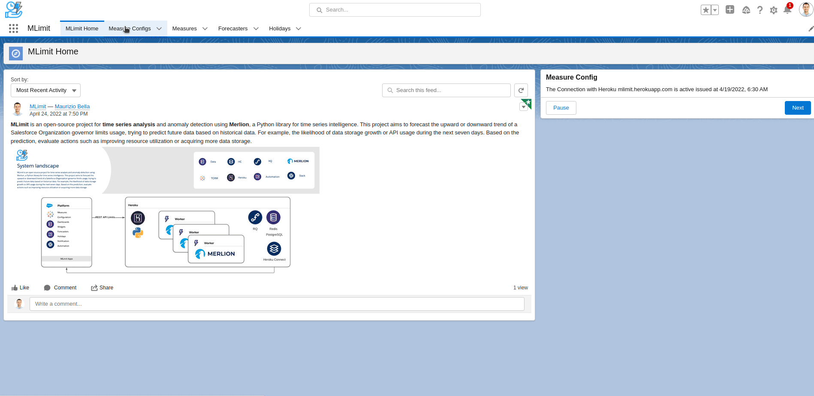
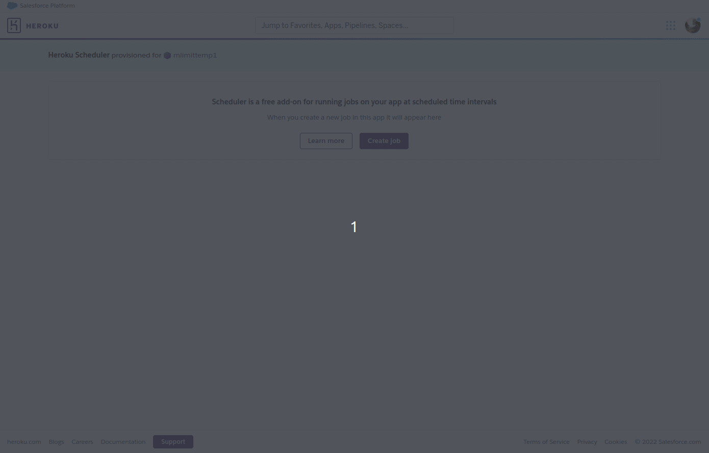
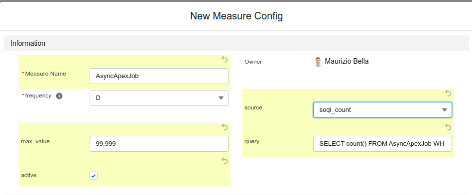

# MLimit Time Series Analysis with Salesforce Limits

MLimit is an open-source project for time series analysis and anomaly detection using [Merlion](https://github.com/salesforce/Merlion) a Python library for time series intelligence. This project aims to forecast the upward or downward trend of a Salesforce Organization governor [limits](https://developer.salesforce.com/docs/atlas.en-us.api_rest.meta/api_rest/resources_limits.htm) usage as time-dependent variables, trying to predict future data based on historical data. For example, the likelihood of data storage growth or API usage during the next seven days. Based on the prediction, evaluate actions such as improving resource utilization or acquiring more data storage.

This project is composed by multiple layers
- [Mlimit-merlion](https://github.com/MaurizioBella/mlimit-merlion) Core engine for the time-series-analsys.
- [mlimit-sf](https://github.com/MaurizioBella/mlimit-sf) Components needed to show the forecasted data in Salesforce acting as a Presentation Layer.

#### State of Art


<!--
- [Documentation](https://mauriziobella.github.io/mlimit/) (working in progress)
-->

## Prerequisite

- You need to install this package [mlimit-sf](https://github.com/MaurizioBella/mlimit-sf) first, If you want to connect ```Mlimit-merlion``` with a Salesforce Organization
- You can use mlimit-merlion in Heroku or in your local computer

## Deploy it to Heroku

[](https://heroku.com/deploy)

1. Go to Heroku Resources and check if Web and Worker dynos are up & running
1. You can complete the Heroku Connect configuration. Click on Heroku Connect in Heroku Resources and connect Heroku to the Salesforce Organization
3. Import the [Connect configuration](https://devcenter.heroku.com/articles/managing-heroku-connect-mappings#import-and-export-of-mappings) using the file mlimit_hc_config.json.json in the folder /extra
4. Take note of the SECRET_KEY in Config Vars
5. Go to the Salesforce Org, change the password in the Named Credential "mlimitcore" and complete the configuration on the Salesforce Home Page "Mlimit Home". More here [mlimit-sf](https://github.com/MaurizioBella/mlimit-sf)


### Jobs schedule

#### Once deployed the App add the following jobs



- **Hourly job** using for example Heroku Scheduler:

```sh
python jobs/hourly --freq-hourly
```

- **Daily job** using for example Heroku Scheduler:

```sh
$ python jobs/hourly --freq-daily
```

- **Daily job** using for example Heroku Scheduler:

```sh
python jobs/hourly --train-only
```

- You can change them based on your business requirements and based on the frequency configured on Measures Config entity

## Deploy it to your local computer

- Requirement: python3, pip3, PostgreSQL and Redis
- (extras) you can use the docker configuration ```docker-compose.yml``` in the folder /extra
```sh
cd extra;docker-compose build; docker-compose up --detach
```
- Create a file ```.env``` as a copy from ```env_template``` in the root folder and configure it as explained later

### Installation

```sh
python3 -m venv env
source env/bin/activate
pip install -r requirements.txt # (pip install [package_name] -U)
python src/release/postdeploy/ # just the first time to configure the database
python src/release/postdeploy/add_demo_data.py # (extras) if you want to add some dummy records to train the model
```

### Run it locally

```sh
python worker.py # it works only with WORKER_TYPE=2
python jobs/hourly --train-only # train the model
python jobs/hourly # start forecasting
rq info --interval 0.5 # monitoring the Redis queue
```
- Authenticate MLimit with a Salesforce Org
```
./run.sh
```
- Go to http://localhost:8000/login it starts an oauth2 web server flow with the configured Salesforce Org


### MLimit Configuration

- For local development configure the file ```.env```
- For Heroku you can use the [Config Vars](https://devcenter.heroku.com/articles/config-vars)

#### OAuth 2 (default and recommended)

- CONSUMER_KEY (The connected app consumer key, which you can find on the connected app Manage Connected Apps page or from the connected app definition.)
- CONSUMER_SECRET (The connected app consumer secret, which you can find on the connected app Manage Connected Apps page or from the connected app definition.)
- SFDC_MYDOMAIN (The My Domain uses Salesforce domain suffixes, example: ```company.my.salesforce.com```)
- SFDC_AUTH (default set to ```oauth2```)

#### Soap Login

- SFDC_USERNAME (Salesforce Username used to retry the Governor limits)
- SFDC_PASSWORD (Salesforce User Password)
- SFDC_SECURITY_TOKEN (Salesforce User Security Token)
- SFDC_MYDOMAIN (The My Domain uses Salesforce domain suffixes, example: company.my.salesforce.com)
- SFDC_AUTH (change to ```login```)
    
#### Merlion configuration
- MERLION_PLOT_SHOW (```True``` or ```False``` to see the plot - it works only locally)
- MERLION_TRAINING_SAMPLE (defaul ```90``` - It uses 90% of the DataFrame as training data and the 10% as testing data
- MERLION_PREDICT_MODEL Specify the model ```ensemble``` or ```selector```
- MERLION_LIMIT_EVENTS (default 12 - history of minimum data to start forecasting)
- MERLION_MAX_FORECAST_STEPS (default 100 - maximum number of forecast steps)
#### Other configurations
 
- DATABASE_HEROKU_CONNECT   : ```True``` if you want to use it with Heroku Connect (False for local project)
- DATABASE_RETENTION_DAYS   : Delete records older than # days (default 7)
- WORKER_TYPE               : Jobs executed via web (```1```), or via worker (```2```)
- RETRY_DATA_FROM_SF        : ```True``` or ```False``` to retry data from the Salesforce Org or not
- AWS_S3_ENABLE             : ```True``` or ```False``` to save the models in AWS S3
- AWS_S3_BUCKET_NAME        : the bucket name (configure AWS_S3_ACCESS_KEY_ID and AWS_S3_SECRET_ACCESS_KEY)
- WEBHOOK_URL               : add the webhook URL. Events with Logging.ERROR are sent to that endpoint

### Main Entities
- **Forecaster** (salesforce.forecaster__c) Contains a prediction for every historical value present in the dataset plus additional forecasts for the number of periods passed through the method
- **Measure** (salesforce.measure__c) univariate time series consists of single (scalar) observations recorded sequentially over equal time increments. It is possible to train the model using the most recent historical data at a regular interval cadence as well as forecasting models up to a maximum number of steps we would like to forecast. 
- **Measure Config** (salesforce.measureconfig__c) Governor limits enabled related to those measures. Only those measures with measure config flag active__c = true are taken into consideration for the forecasting. You can add a new ``measure`` based on a count() soql. Following an example


#### Extras
- ```MLimit.postman_collection.json``` Postman collection. Header: set ```X-Fields``` as the OrgId and Authorization as ```"basic username:SECRET_KEY"``` Salesforce username:Heroku SECRET_KEY should be base64 encoded
- Go to src.prediction.selector function ```model_evaluation``` If you want to change forecast models used by MLimit

## Changelog

### Version 0.1 (2022.09.05)

- Initial release

## License

MLimit-merlion is licensed under the [MIT license](LICENSE).

## Merlion Project

```
@article{bhatnagar2021merlion,
      title={Merlion: A Machine Learning Library for Time Series},
      author={Aadyot Bhatnagar and Paul Kassianik and Chenghao Liu and Tian Lan and Wenzhuo Yang
              and Rowan Cassius and Doyen Sahoo and Devansh Arpit and Sri Subramanian and Gerald Woo
              and Amrita Saha and Arun Kumar Jagota and Gokulakrishnan Gopalakrishnan and Manpreet Singh
              and K C Krithika and Sukumar Maddineni and Daeki Cho and Bo Zong and Yingbo Zhou
              and Caiming Xiong and Silvio Savarese and Steven Hoi and Huan Wang},
      year={2021},
      eprint={2109.09265},
      archivePrefix={arXiv},
      primaryClass={cs.LG}
}
```